# Wastewater Sequencing Analysis

This repository hosts scripts and notebooks for processing metagenomic data from hospital wastewater, quantifying pathogen abundance, and characterizing antimicrobial resistance (AMR). The workflow begins with raw Oxford Nanopore reads and proceeds through filtering, down‑sampling, assembly, classification, and resistome analytics.

## Analytical Notebooks

> ⚠️ **IMPORTANT:** **Refer to each folder for all the figures and the Markdown document with detailed descriptions** of the statistical analyses and the procedures implemented.

- ### [`pathogen_abundance/exploratory_pathogen_analysis.md`](pathogen_abundance/exploratory_pathogen_analysis.md)

    Exploratory plots of pathogen read percentages per hospital, comparing Sylph, ConQuR, and Kraken methods.  
    Includes mock‑community validation and per‑hospital comparisons, with all output images saved in `exploratory_pathogen_analysis/`.

    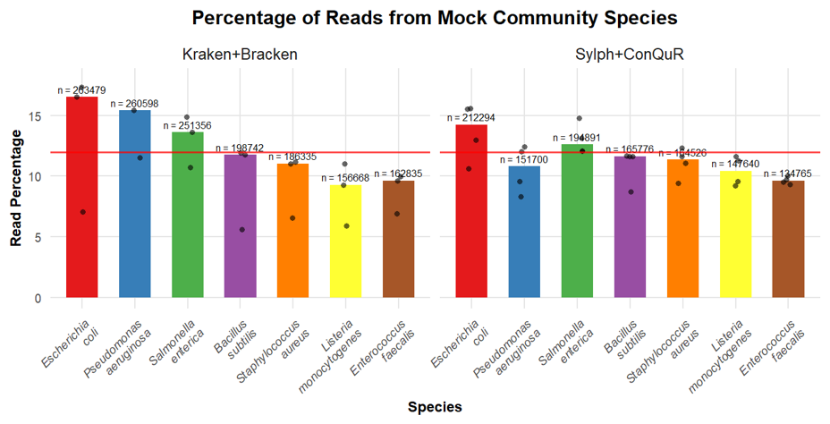

    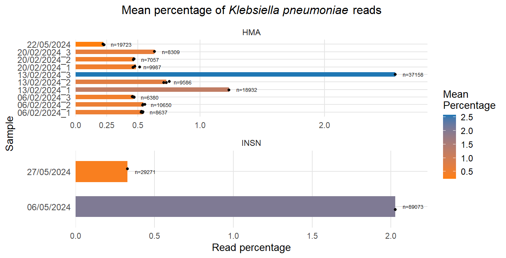

- ### [`pathogen_abundance/pathogen_timeseries_multi.md`](pathogen_abundance/pathogen_timeseries_multi.md)  
    Harmonizes metadata and Sylph outputs from multiple sequencing runs (`MW`, `temporal`, `17_set`, `seq2111`, `seq1212`).  
    Computes species‑level relative abundance, draws temporal facets with median ± IQR, evaluates library size, adds clinical‑event markers, and produces correlation plots between abundance or assigned reads versus total reads.

    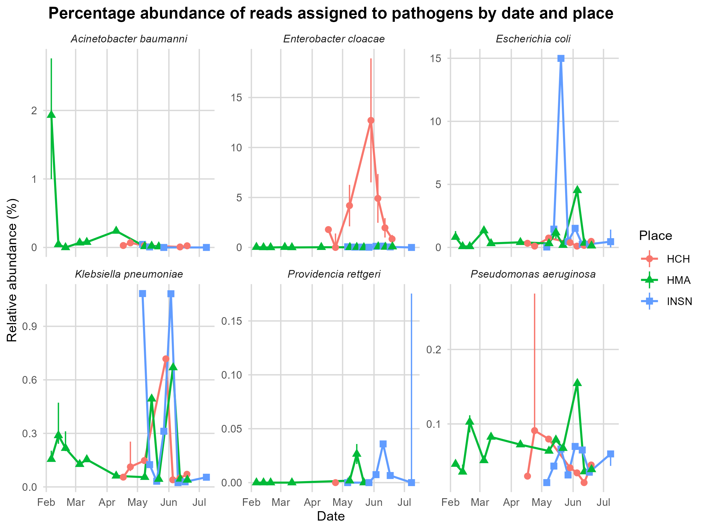

    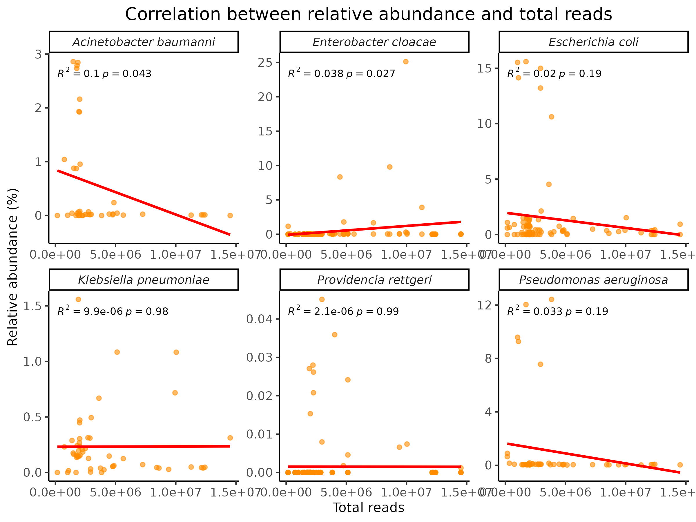    

- ### [`resistance_analysis/pathogen_resistance.md`](resistance_analysis/pathogen_resistance.md)  
    Builds a resistome ordination for a chosen pathogen (default *Acinetobacter baumannii*, but also performed on *Escherichia coli* and *Klebsiella pneumoniae*).  
    Merges per‑run resistance counts, normalizes to CPM, performs Bray–Curtis PCoA, colors samples by site/batch/date, and lists [`top genes correlated`](https://chalco777.github.io/wastewaters_project/resistance_analysis/pathogen_resistance/top_genes_Acinetobacter_baumanniipcoa.html) with the primary axis.

    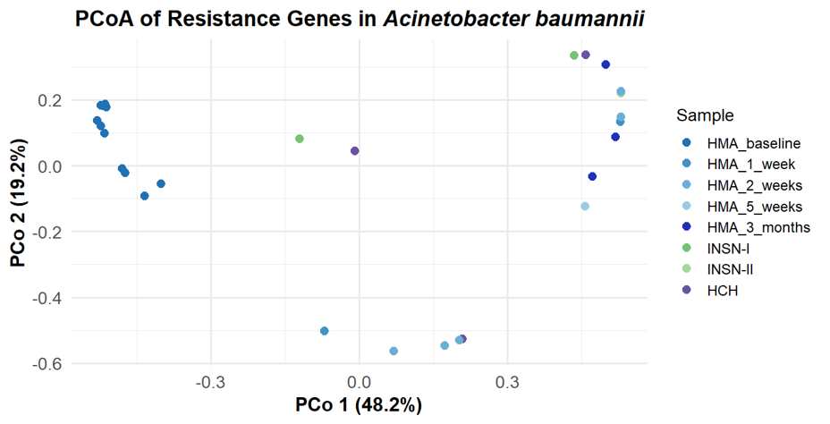

- ### [`resistance_analysis/resistance_abundance.md`](resistance_analysis/resistance_abundance.md)  
    Joins resistance‑gene counts with total read counts and metadata.  
    Generates carbapenem‑gene barplots by site, expands to six antibiotic classes for temporal trend lines, and overlays a histogram of clinical resistance events.

    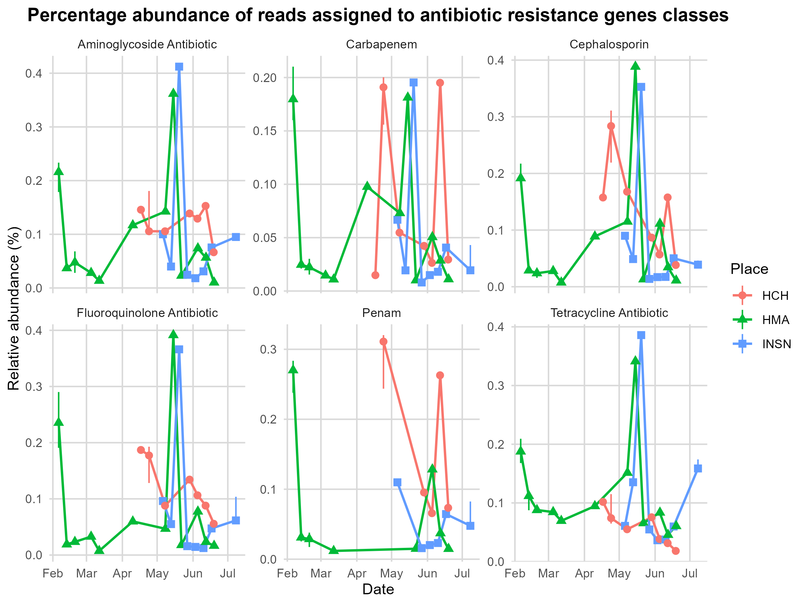

    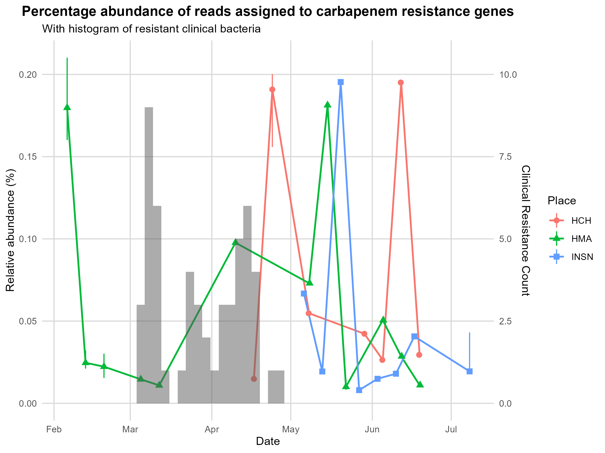

- ### [`resistance_analysis/resistome_carbapenem_analysis.md`](resistance_analysis/resistome_carbapenem_analysis.md)  
    Integrates multiple sequencing runs to assemble a carbapenem‑gene CPM matrix, performs PCoA, ranks genes by [correlation with axes](https://chalco777.github.io/wastewaters_project/resistance_analysis/carbapenem_resistance/top_genes_table_carbapenemgenespcoa.html), examines *batch effects*, and illustrates a ConQuR batch‑correction pass.

    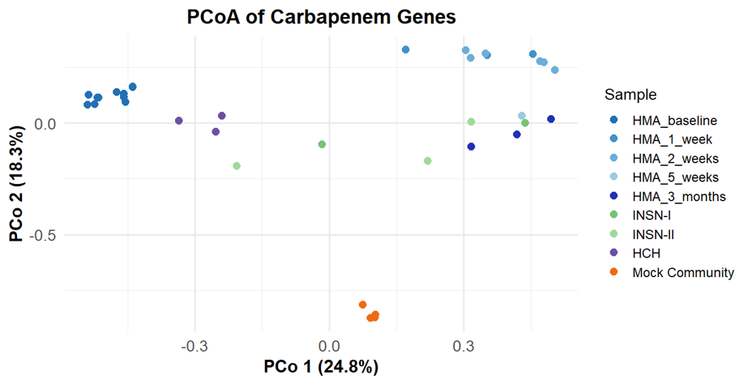

    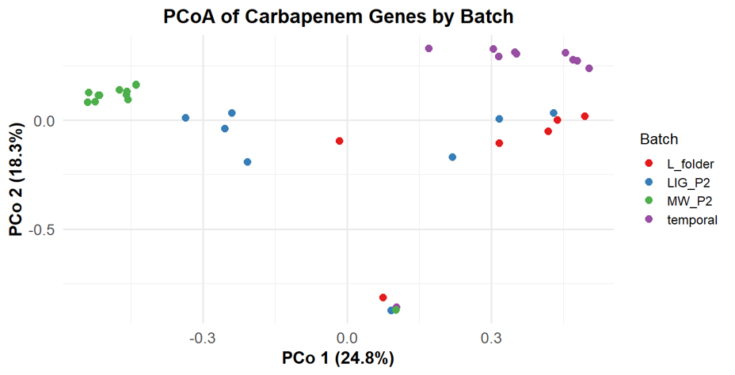
    

- ### [`downsampling_resistome_variation/scripts/rgi-resistance_proport_plot_contig.md`](downsampling_resistome_variation/scripts/rgi-resistance_proport_plot_contig.md)
  
    Calculates the fraction of reads mapping to carbapenem‑resistance (CRE) regions that are themselves classified as AMR across several downsampling levels.  
    Cleans and joins RGI read summaries with per‑region read counts, filters low‑coverage cases, bootstrap‑estimates median resistant proportions and 95 % CIs, and plots per‑gene and overall trends.

    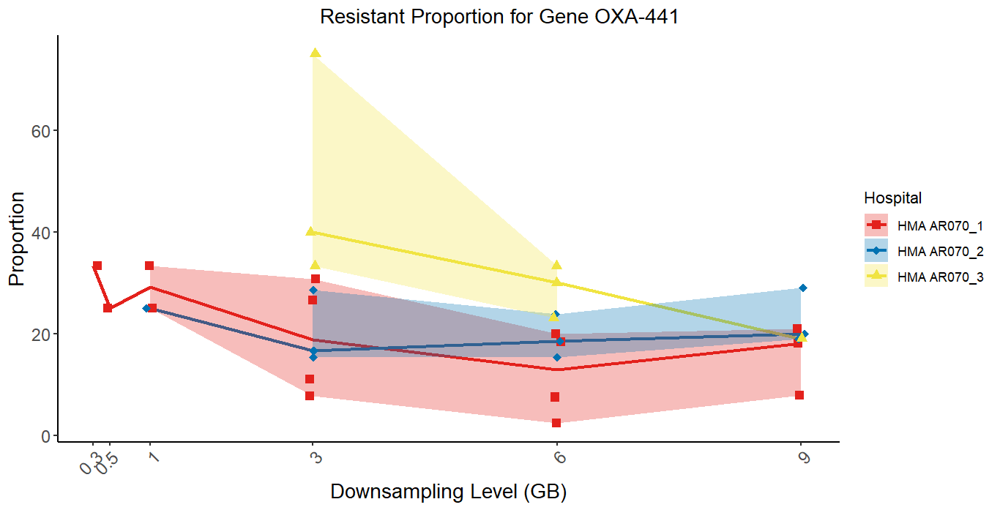

    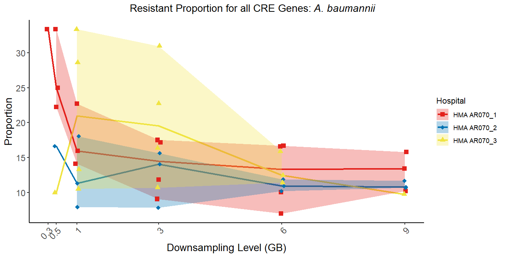

Note that the notebooks operate on the outputs generated by the software scripts.

## Software Scripts Folder

 Shell, Python, and Nextflow scripts for preprocessing, filtering, assembly, classification, and downstream analysis are organized under the `software_scripts/` directory. These include:

- Extraction and filtering of FASTQ files
- Barcode merging
- Taxonomic classification (Kraken2/Bracken, Sylph)
- Downsampling and assembly pipelines
- Resistome analysis workflows

Nextflow pipelines for advanced assembly and QC are located in `software_scripts/pathogen_assembly/`.

### Root scripts (`software_scripts/`)

| Script                   | Function                                                                                                                        |
|--------------------------|--------------------------------------------------------------------------------------------------------------------------------|
| 01_bam_to_fastq.sh       | Converts demultiplexed BAMs to gzip‑compressed FASTQ per barcode and merges files across pods.                                 |
| 02_filtlong.sh           | Runs Filtlong to keep reads ≥200 bp, writing filtered FASTQs.                                                                  |
| 03_same_barcode_joiner.sh| Aggregates FASTQs from three directories by barcode, producing a unified file for each barcode in results/combined_barcodes.   |

### Pathogen abundance (`software_scripts/pathogen_abundance/`)

| Script             | Function                                                                                                                        |
|--------------------|--------------------------------------------------------------------------------------------------------------------------------|
| kraken_bracken.nf  | Nextflow pipeline: classifies combined FASTQs with Kraken2 and estimates species abundance with Bracken; publishes reports to results/kraken2 and results/bracken. |
| sylph.sh           | (Partially commented) script to sketch FASTQs with Sylph, profile against GTDB, query unknowns, and count total reads per barcode in countreads.tsv.               |

### Resistance analysis (`software_scripts/resistance_analysis/`)

| Script                              | Purpose & Main Steps                                                                                                                                    |
|--------------------------------------|---------------------------------------------------------------------------------------------------------------------------------------------------------|
| 01_downsampling.sh                   | Uses BBMap’s reformat.sh to downsample each barcode’s combined reads to ~5.2 Gb of sequence.                                                            |
| 02_flye.sh                           | Runs Flye (meta mode) on the downsampled reads to build de‑novo assemblies for every barcode.                                                           |
| 03_rgi.sh                            | Executes RGI main on each assembly to predict antibiotic-resistance genes using a local CARD database.                                                  |
| 04_01_rgi_bed.py                     | Converts RGI tabular summaries into BED files, standardizing contig names and embedding gene/drug‑class annotations.                                    |
| 04_02_pathogen_origin_prediction.sh  | Runs rgi kmer_query on RGI JSON outputs to infer pathogen-of-origin for resistance genes, recording results per barcode.                                |
| 04_03_rgi_pathogen_origin_bed.py     | Merges RGI gene calls with k‑mer pathogen predictions and writes BED files where each line contains contig coordinates, resistance annotation, and predicted species. |
| 05_minimap.sh                        | Aligns downsampled reads back to their assemblies with minimap2, producing sorted/indexed BAM files for coverage analyses.                              |
| 06_rgi_coverage.sh                   | Computes coverage of resistance‑gene BED intervals using bedtools; also builds required genome files from assembly indices.                             |
| 07_01_concatenate_rgi_coverage.sh    | Concatenates all per-barcode coverage reports into a single TSV and tags each row with its sample ID.                                                   |
| 07_02_concatenate_rgi_pathogen_origin_coverage.py | Joins coverage metrics with pathogen‑origin annotations, generates per-barcode merged tables, and concatenates them into a project‑wide summary.        |

### Pathogen assembly workflows (`software_scripts/pathogen_assembly/`)

| Script                   | Function                                                                                                                        |
|--------------------------|--------------------------------------------------------------------------------------------------------------------------------|
| bin_polishing.nf         | Maps reads to preliminary bins, converts alignments to FASTQ, polishes with Medaka, and evaluates each polished bin with CheckM2. |
| gtdb.nf                  | Runs GTDB‑Tk (identify, align, classify) on Metabat bins to assign taxonomy.                                                   |
| map_and_sort_assembly.nf | Aligns reads to assemblies using minimap2, sorts and indexes BAMs with samtools, and records mapping stats.                    |
| medaka_polish_qc.nf      | Polishes bins with Medaka and performs CheckM2 quality assessment (polished bin workflow only).                               |

## Usage Notes

Most scripts expect specific absolute paths and rely on external tools: **BBMap, Flye, RGI (with CARD), minimap2, samtools, bedtools, Nextflow, Kraken2, Bracken, Sylph, Medaka, CheckM2, GTDB‑Tk, ConQuR**, etc.

Adjust directories and environment activation lines to match your system before running.

Generated figures, tables, and intermediate data are stored in the same folders as their source scripts for traceability.

## Getting Started

**Preprocessing & Classification**  
Use the scripts in `software_scripts/` to extract FASTQs, filter reads, merge by barcode, run Kraken2/Bracken or Sylph, and optionally perform downsampling and assembly/resistome pipelines.

**Exploratory Analyses**  
Run R Markdown notebooks in `pathogen_abundance/` for taxonomic trends and `downsampling_resistome_variation/scripts/` or `resistance_analysis/` for AMR‑focused studies. Figures appear in corresponding `plots/`, `data/`, or analysis folders.

**Advanced Assembly & QC**  

Nextflow pipelines under `software_scripts/pathogen_assembly/` provide polishing, taxonomic assignment, and mapping QC for assembled bins.
